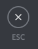

# Discord, logiciel alternatif de t'chat face au COVID-19

## Introduction

### Qu'est-ce que Discord ?

Discord est un service de t'chat gratuit similaire à Skype, IRC pour les plus vieux ou très similaire à Slack pour les plus professionnels. Il a été conçu au départ pour les jeux, mais son utilisation est désormais très diversifiée.

### 3 Raisons pour l'utiliser

1. Discord est **adapté pour des groupes massifs** (*entre 50 et 5000 personnes, même si la quantité est illimitée théoriquement*) grâce à un système basé sur des salons de discutions, organisé en catégories, avec des rôles assignés à une personne, pouvant lui donner accès ou cacher certains salons.
2. Discord offre la possibilité de **capturer son écran en direct** (particulièrement utile pour faire cours sur power point), passer des **appels téléphoniques**. Depuis l'arrivée du Covid-19, la limite de connexion en live est passée de 10 à 50 personnes.
3. En plus d'être gratuit, **Discord est multi-plateforme** : Windows, Mac / iOS, Distributions Linux / Android, et même sur navigateur. __Plus besoin d'installer quoi que ce soit !__

## Comment on commence ?

### Préparer l'environnement

*Pour cette partie, il est recommandé de suivre les étapes une par une*

↪ Tout d'abord, il est primordial de se **créer un compte** :

* **Sur PC** : <https://discordapp.com/register>
* **Sur mobile** : télécharger l'application Discord via le [Google Play (pour Android)](https://play.google.com/store/apps/details?id=com.discord) ou via [l'App Store (pour iOS)](https://apps.apple.com/fr/app/discord/id985746746). Un bouton pour créer votre compte vous est proposé.

↪ Ensuite, il vous faut **installer Discord** (ou pas...) :

* Si vous êtes Professeur, je vous recommande d'installer [l'application de bureau Discord]().
* Si vous êtes élèves et que vous débutez sur Discord, installer l'application mobile peut être un bon choix pour avoir des notifications. Je vous recommande également d'utiliser la [Version en ligne de Discord](https://discordapp.com/channels/@me) *(le lien ne marche __qu'après inscription__)* sur PC en journée, qui ne nécessite aucune installation

↪ Enfin, une fois le compte créé, il est nécessaire de **rejoindre le serveur de t'chat** : Il suffit simplement de suivre le lien menant vers le serveur de votre classe (généralement le lien ressemble à ça: `https://discord.gg/xxxxxxx`). Si le serveur a été créé à titre *éducatif*, il est mieux de préciser **votre nom et prénom** d'une manière ou d'une autre: soit en envoyant le message, soit en vous renommant.


### Fonctionnement basique de Discord

Si vous avez eu une expérience plutôt professionnelle assistée par ordinateur, vous avez sans doute connu le logiciel [Slack](https://slack.com/). Discord fonctionne quasiment sur le même principe.

↪ **Un serveur Discord est composé de salons de discussions regroupées en catégories.** Une simple capture d'écran peut tout résumer : 


*Sur mobile: il faudra appuyer sur l'icône  afin de pouvoir voir la liste des salons (et accessoirement la liste des serveurs sur lesquels vous êtes)*

*Ce système permet donc d'organiser la discussion sur des thèmes dans le même endroit pour tout le monde, y compris pour les discussions téléphoniques / lives. Sur la capture d'écran, certaines catégories ont été réduites*

↪ Puisque le serveur comporte plusieurs types de personnes (par exemple des élèves, des profs, une équipe de modération...), il est possible d'assigner **des rôles** afin de les différencier : 


*En cliquant sur un utilisateur, vous pouvez voir les rôles, et en assigner si vous en avez les permissions nécessaires*

*Sur mobile: il faudra appuyer sur l'icône *

↪ Les rôles peuvent donner des droits (*par exemple, les profs peuvent avoir un droit d'administration totale sur le serveur*) mais aussi permettre de rendre les salons de discussions visibles ou invisibles : 


*Ici, le salon #staff est dédié aux personnes possédant les droits de modération (par exemple des profs, des délégués...)*

## Utilisation de Discord

### Messages, réactions, emojis, mentions

En cliquant sur un salon de discussion (ou channel), vous aurez accès à son historique de conversation et une barre est visible en bas :


↪ Le logo  est pour envoyer une pièce jointe. Elle est limitée à 8 Mo (on peut l'augmenter grâce à un [boost du serveur](#booster-un-serveur).).

> Si vous envoyez des PowerPoint Microsoft, privilégiez l'envoi sur [OneDrive](https://onedrive.live.com/), qui propose une prévisualisation en ligne basique.
>
> Sinon, si le fichier dépasse tout de même la limite, utilisez [Google Drive](https://drive.google.com/).
> D'autres services de drive/cloud peuvent aussi être utilisé (comme [Dropbox](https://www.dropbox.com/) ou [Mega](https://mega.nz/)) mais il est recommandé d'utilser les deux cité dessus.

La gestion des pièces jointes est assez pittoresque sur mobile. Je recommande donc l'utilisation d'un PC pour l'envoi chez les professeurs.

↪ Entez votre message et appuyez sur la touche `[entrée]` :leftwards_arrow_with_hook: pour envoyer. Pour sauter une ligne, appuyez sur `[entrée]` (:leftwards_arrow_with_hook:) tout en maintenant la touche `[Majuscule]` (:arrow_up:).
*À noter que cela n'est pas nécessaire pour la version mobile*

↪ Pour ajouter des emojis, cliquez sur le petit émoji de la barre à droite. Une liste s'affichera. Les emojis sont codés en texte, entre des `:` (ex: `:smile:` affichera :smile:). D'autres options sont disponibles (telles que les Gif), je vous laisse découvrir cela.

↪ Les mentions font partie du système de Discord : mentionner quelqu'un lui fera afficher un message jaune, et forcera l'affichage d'une notification accompagnée de son petit indicateur rouge. Ces mentions peuvent parfois déranger, c'est pour cela qu'il faut les utiliser avec modération. 

Pour mentionner, il suffit de insérer un arobase `@` et d'écrire le nom de la personne ou d'un rôle (*attention: toujours espacer la fin d'une mention et un autre mot, sont exclus les signes de ponctuation*), à noter qu'une liste de personne s'ouvre déjà juste avec l'insertion de l'arobase `@`, vous pouvez ainsi séléctioner une personne ou un rôle à travers ce menu. 

Certaines mentions spéciales existent : `@everyone` pour notifier tout le serveur et `@here` qui permet de mentionner toutes les personnes présentes sur le salon textuel. Merci de ne pas ces mentions sauf en cas de besoin __**extrême**__, généralement l'interdiction de ces mentions seront proscrites.

### Vocal, Live, Groupes privés pour vocal

↪ Il est possible de passer un appel vocal groupé dans le serveur : il suffit juste de cliquer sur un salon dont le nom est précédé par une icône de haut parleur :speaker: . Les personnes sont libres de rejoindre le vocal, et ne sont pas notifiées. Avec la fonction *"Priority Speaker"*, les rôles ayant cette fonctionalité ont un droit de régulation sur le serveur : changer le son des autres pour qu'on écoute qu'eux , expulser quelqu'un...

Si ceci est affiché, vous êtes connectés : 


> *Si vous avez des problèmes lors d'appels vocaux, veuillez vous référer [ici](#voix--vid%c3%a9o).*

↪ La fonction Live permet de partager son écran ou le contenu d'une application durant l'appel vocal groupé. Cela est particulièrement pratique pour faire cours sur un PowerPoint (ou autre). Si vous faites un cours sur webcam uniquement, YouTube propose un service de live qui est mieux adapté. *Si vous souhaitez faire les deux, l'utilisation d'un logiciel de stream tel qu'OBS est à proscrire, se référer [ici]()*

↪ Pour utiliser Live, vous devez être connecté à un serveur vocal et utiliser l'application de bureau (ne fonctionne pas sur navigateur). Cela fonctionne aussi bien sur Windows 7 que sur une distribution Linux (non testé sur Mac en revanche). Cliquez sur l’icône . 

↪ Il est possible de changer le contenu que vous diffusez en appuyer sur cette même icône.

↪ Si il n'est pas disponible, vous n'êtes pas sur l'appli PC, ou votre ordinateur n'est pas supporté, ou bien votre version de Discord n'est pas à jour (ce qui est très peu le cas puisque Discord est constamment mis à jour).

Si tout va bien, une fenêtre s'affiche :


↪ Choisissez une application ou un écran à diffuser et cliquez sur `[Passer au direct]`. Ainsi, le contenu que vous aviez choisi de diffuser sera visible par tous les utilisateurs connectés au salon vocal.

↪ Vous pouvez arrêter de diffuser à tout moment, en cliquant sur l'icône .

## Utilisation avancée

> Dans cette section:
>
> * Lors d'indications de raccourcis claviers, le signe `+` indique que la touche qui la précède doit être maintenu le long de la combinaison)
> * Les clics droit sur souris seront traduits par des appuis long sur mobile, les menus sont similaires.
> * Passer sa souris sur une option revient à cliquer sur l'option sur mobile.

### Écriture de messages avancés avec le Markdown

Il est possible de styliser vos messages avec du Markdown.

#### Qu'est-ce que le Markdown? (petite partie histoire)

↪ Le Markdown est un language créé par John Gruber en 2004 en collaboration avec Aaron Swartz pour la syntaxe.

↪ Le but principal est la *lisibilité* - que le language soit visible en tant que tel, sans pouvoir remarquer qu'il a été balisé avec des balises ou des instructions de mise en page.

*([Source: Wikipedia en anglais](https://en.wikipedia.org/wiki/Markdown))*

↪ Pour résumer, c'est un language visant à faciliter la mise en page à partir de texte brut. Par exemple, ce que vous êtez en train de lire, c'est du Markdown. Il existe plusieurs types de Markdown, et certains son propre à d'autres, mais les syntaxes sont très similaire. Par exemple, ce que vous lisez a été écrit en *GitHub Flavoured Markdown (GFM)*.

↪ Dans notre cas, c'est une syntaxe propre à Discord (puisque toutes les syntaxes de bases n'ont pas encore été implémentées et d'autres syntaxes ont été rajoutées).

#### Syntaxes

> Pour faire le signe `~` sur ordinateur:
>
> Windows: `Alt Gr`+`é` suivi d'un espace.
>
> * Mac: `⌥ (Option)`+`n`
>
> Pour faire le signe ` sur ordinateur:
>
> * Windows: `Alt Gr`+`è` suivi d'un espace.
> * Mac: Une touche est assignée, à côté de la touche `ù`.

Voici quelques synatxes.

##### ► Accentuation

    *Ce texte est en italique*
    _Ce texte est aussi en italique_

    **Ce texte est en gras**

    __Ce texte est souligné__

    ~~Ce texte est barré~~

    __Vous ~~devez~~ **pouvez** *combiner* les ***syntaxes***__

↪ Ce qui donne:

  *Ce texte est en italique*
  
  _Ce texte est aussi en italique_

  **Ce texte est en gras**

  __Ce texte est souligné__

  ~~Ce texte est barré~~

  __Vous ~~devez~~ **pouvez** *combiner* les ***syntaxes***__

*(Ici la GFM ne supporte pas les textes soulignés, mais croyez nous, on peut souligner sur Discord!)*

##### ► Bloc de citation

> *Ici, il ne faut pas négliger l'espace.*

      Citation de Confucius:

      > Je ne cherche pas à connaître les réponses,
      >
      > je cherche à comprendre les questions.

↪ Ce qui donne:

Citation de Confucius:

> Je ne cherche pas à connaître les réponses,
>
> je cherche à comprendre les questions.

##### ► Ligne ou bout de code

    La ligne `const x = 15;` définit une variable x dont la valeur fixe est 15 (on ne peut pas la changer).

↪ Ce qui donne:

La ligne `const x = 15;` définit une variable x dont la valeur fixe est 15 (on ne peut pas la changer).

##### ► Bloc de code

    Bloc de code **sans** mise en évidence de la syntaxe:
    ```
    def oui(u):
      if str(u).upper == "OUI:
        return "Positif"
      else:
        return "Négatif"
    ```

    Bloc de code **avec** mise en évidence de la syntaxe:
    ```javascript
    var x = 9;

    function tester(variable){
      if(variable >= 5){
        console.log("Est supérieur ou égal à 5");
      };
      else{
        console.error("Est inférieur à 5");
      };
    };

    tester(x);
    ```

↪ Ce qui donne:

Bloc de code **sans** mise en évidence de la syntaxe:
```
def oui(u):
  if str(u).upper == "OUI:
    return "Positif"
  else:
    return "Négatif"
```

Bloc de code **avec** mise en évidence de la syntaxe:

```javascript
var x = 9;

function tester(variable){
  if(variable >= 5){
    console.log("Est supérieur ou égal à 5");
  };
  else{
    console.error("Est inférieur à 5");
  };
};

tester(x);
```

### Indésirable : Notifications, Catégories

↪ Si les notifications deviennent trop massives, il existe plusieurs moyens de les limiter.

#### Mode "Ne pas déranger", la méthode la plus efficace

↪ Le mode "Ne pas déranger", est un statut qui indique au travers d'un icône rouge à côté de votre photo de profil que vous ne recevrez aucune notification.

Pour l'activer, il faut cliquer sur votre **icône de profil** (et pas votre nom) et vous pourrez choisir différents statuts. Ici on veut le mode "Ne pas déranger".

 

*Exemple pour se mettre en mode "Ne pas déranger" sur mobile et ordinateur*

#### Rendre muet

Il est possible de rendre muet un salon, une catégorie ou un serveur tout entier.

↪ Pour rendre muet un salon, une catégore ou un serveur il faut cliquer droit sur le nom de celui-ci, passer ça souris sur "Rendre muet ce <...>" et choisir la durée pour laquelle vous voulez rendre muet.

↪ Vous pouvez ne plus le rendre muet en cliquant droit sur le salon et cliquer sur "Rétablir la voix de ce <...>".

 

*Exemple pour rendre muet un salon sur mobile et ordinateur*

#### Paramétrage des notifications

On peut aussi changer quelles notifications seront utilisées pour un serveur ou un salon:

* Pour un salon, il faut cliquer droit sur le nom, passer ça souris sur "Notifications" et choisir un réglage.
* Pour un serveur tout entier, il faut simplement cliquer sur le nom du serveur.

Une fois cliqué, différents réglages sont possibles, pour les salons et les serveurs on peut régler les notifications pour:

* Qu'elles apparaissent selon le réglage défini pour ceux du serveur (salons uniquement)
* Qu'elles apparaissent pour tous les messages
* Qu'elles apparaissent pour les mentions uniquement
* Qu'elles n'apparaissent pas du tout

Pour les serveurs:

* On peut choisir de les rendre muets ou non (un peu [comme tout à l'heure](#rendre-muet))
* On peut choisir de supprimer les mentions `@everyone` et `@here`
* On peut choisir de supprimer toutes les mentions de rôles
* Choisir si on active les notifications push pour mobile
* Et également choisir pour quels salons cela ne doit pas s'appliquer.


*Exemple de l'affichge des paramètres de notifications sur la version ordinateur*

> *Il existe une dernière façon d'enlever les notifications exclusivement pour la version ordinateurs, voir: [Notifications](#notifications)*

### Paramètres

> * *Ici seront listés les paramètres qu'on recommande de changer selon vos besoins*
>
> * *Certains paramètres ne s'appliquent que sur ordinateur, c'est pour ça qu'on recommande de modifier ces paramètres sur ordinateur. Les captures et instructions seront disponibles uniquement pour la version ordinateur.*

↪ Pour accéder aux paramètres, il faut appuyer sur l'icône  à côté des icônes  et  à côté de votre nom en bas des salons.


↪ La liste des différents onglets se trouve sur la gauche, appuyer sur `[échap]` ou cliquer sur l'icône  pour revenir sur l'interface principale.


#### Voix & vidéo

↪ La voix et la vidéo sont importantes dans Discord. C'est pour cela qu'il est important de bien configurer son système vocal et vidéo. Généralement, c'est de la que vient les principaux problèmes basiques tels que le silence lorsque vous parlez, vous n'entendez pas les autres etc.


##### ► Entrée et sortie

↪ Sur ce menu, vous pouvez configurer une entrée micro et une sortie et régler leur volume.


Vérifiez que vous utilisez la bonne entrée et la bonne sortie:

* Pour l'entrée, choisissez-en une parmi la liste, essayez une par une jusqu'à ce que cette barre devienne verte lorsque vous parlez:


* Pour la sortie, faites de même et verifiez que vous entendez le signal sonore dans le support auditif que vous utilisez.

##### ► Mode d'entrée

↪ Ce menu, vous permet de configurer quel mode d'entrée utiliser. On a ici deux choix:

* Activité vocale
* Push-to-Talk


Nous vous recommandons d'utiliser l'activité vocale, cela est plus intuitif que d'utiliser une touche de clavier pour communiquer.

##### ► Sensibilité du micro

↪ Ce menu permet de régler la sensibilité du micro. Par défaut, la sensibilité est déterminée automatiquement. Vous pouvez décocher la "case" afin de pouvoir ajuster la sensibilité manuellement.


##### ► Paramétrage vidéo

↪ Si vous utilisez la webcam lors d'appels en privé, vous pouvez utiliser ce menu afin de choisir votre camera et de pouvoir la tester.


#### ► Notifications

> *Cet onglet est la 4ème méthode pour enlever les notifications, pour le reste, ce référer [ici](#ind%c3%a9sirable--notifications-cat%c3%a9gories)*

↪ Ce menu exclusivement reservé aux utilisateurs sur ordinateur, permet de régler plusiseurs choses:

* L'activation des notifications de bureau
* L'activation du badge de messages non lus
* L'activation de la barre des tâches ou du saut de l'icône sur le Dock (pour Mac) lorsqu'il y a de nouvelle notifications
* Et d'autres, je vous laisse découvrir :)

#### ► Apparence

↪ Cet onglet permet de changer l'apparence de Discord, vous pouvez l'adapter selon vos besoins.

> *Nous vous recommandons néanmoins d'utiliser les réglages prédéfinis, c'est bon pour les yeux (sauf la question de taille si besoin)*


*Vous pouvez changer le thème de Discord entre un mode lumière et un mode sombre*


*Vous pouvez changer la disposition des messages entre un mode comfortable et un mode compact (version ordinateur uniquement).*


*Dans la zone d'accessibilité:*

* *Il est possible d'activer la barre en noire pour le thème lumière*
* *Changer la taille de police*
* *Changer le zoom général*

## En conclusion

↪ Discord est un outil certes qui demande à s'habituer, mais qui au final devient pratiquer pour communiquer de manière immédiate, surtout pour des fins éducatifs et pour les classes où parler dans un simple groupe de classe en messagerie instantanée deviendrait un enfer.

↪ Discord à travers de systèmes de rôles, de permissions, de serveurs et de salons, permet de discipliner cette anarchie qu'on avait auparavant sur les messageries instantanées.

↪ Les discussions sont ainsi vite organisées et cadrées.

# Discord Nitro et boost de serveur

## Qu'est-ce que Discord Nitro?

↪ Discord Nitro est un abonnement Discord qui permet d'avoir des fonctionnalités avancés, notamment l'utilisation d'images GIF en tant que photo de profil, un tag personalisé, des émojis personalisés, une limite d'upload plus tolérée...

↪ Vous pouvez accéder à la page d'abonnement Nitro dans les paramètres et un onglet "Discord Nitro" en bleu.

> *Plus d'infos [ici](https://discordapp.com/nitro)*

## Booster un serveur

↪ Booster le serveur, c'est lui faire gagner des niveaux, afin de bénéficier d'avantages telles que l'utilisation d'une bannière, l'augmentation de la tolérance de la taille des fichiers pour tous les utilisateurs etc.

↪ Plusiseurs Boosts sont nécessaires afin de pouvoir monter en niveau.

↪ Un membre du serveur peut booster le serveur en payant un abonnement au serveur. La quantité de Boosts d'un membre dépend de la somme qu'il paye chaque mois.

↪ Un membre possédant [Discord Nitro](#quest-ce-que-discord-nitro), boost automatiquement le serveur de 2 Boosts.

# L'utilisation d'un logiciel de streaming comme OBS afin d'utiliser la webcam en mode Live. (à rédiger.)

# L'article sera mis à jour ultérieurement

