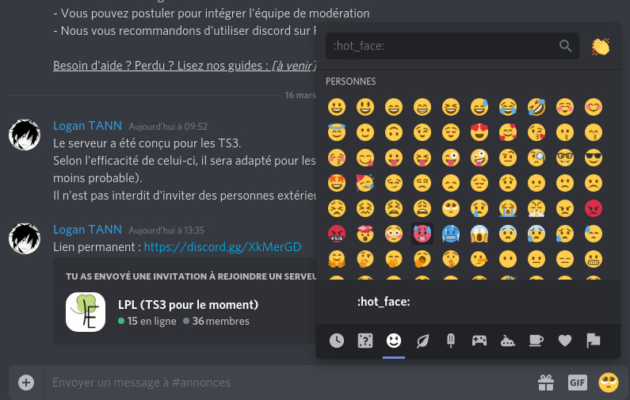

# Discord, logiciel alternatif de t'chat face au COVID-19

## Introduction

### Qu'est-ce que Discord ?

Discord est un service de t'chat gratuit similaire à Skype, IRC pour les plus vieux ou très similaire à Slack pour les plus professionnels. Il a été conçu au départ pour les jeux, mais son utilisation est désormais très diversifiée.

### 3 Raisons pour l'utiliser
1. Discord est **adapté pour des groupes massifs** (*entre 50 et 5000 personnes, même si la quantité est illimitée théoriquement*) grâce à un système basé sur des salons de discutions, organisé en catégories, avec des rôles assignés à une personne, pouvant lui donner accès ou cacher certains salons.
2. Discord offre la possibilité de **capturer son écran en direct** (particulièrement utile pour faire cours sur power point), passer des **appels téléphoniques**. Depuis l'arrivée du Covid-19, la limite de connexion en live est passée de 10 à 50 personnes.
3. En plus d'être gratuit, **discord est Cross-Platform** : Windows, Mac / iOS, Distributions Linux / Android, et même sur navigateur. __Plus besoin d'installer quoi que ce soit !__

## Comment on commence ?

### Préparer l'environnement

↪ Tout d'abord, il est primordial de se **créer un compte** : 

* **Sur PC** : https://discordapp.com/register
* **Sur téléphone** : télécharger l'application discord. un bouton de création de compte est affiché.

↪ Ensuite, il vous faut **installer discord** (ou pas...) : 

* Si vous êtes Professeur, je vous recommande d'installer l'application de bureau discord.
* Si vous êtes élèves et que vous débutez sur discord, installer l'application mobile peut être un bon choix pour avoir des notifications. Je vous recommande également d'utiliser la [Version en ligne de discord](https://discordapp.com/channels/688832946475499580/688832947205439673) sur PC en journée, qui ne nécessite aucune installation

↪ Enfin, une fois le compte créé, il est nécessaire de **rejoindre le serveur de t'chat** : Il suffit simplement de suivre le lien menant vers [le serveur de la classe](https://discord.gg/XkMerGD). À l'arrivée du serveur, merci de préciser systématiquement **votre prénom et nom** dans votre pseudo afin qu'on vous donne un rôle (TS3, Adulte...)

### Fonctionnement basique de Discord

Si vous avez eu une expérience plutôt professionnelle assistée par ordinateur, vous avez sans doute connu le logiciel Slack. Discord fonctionne quasiment sur le même principe.

↪ **Un serveur discord est composé de salons de discussions regroupées en catégories.** Une simple capture d'écran peut tout résumer : 

*Ce système permet donc d'organiser la discussion sur des thèmes dans le même endroit pour tout le monde, y compris pour les discussions téléphoniques / lives. Sur la screen, certaines catégories ont été réduites*

↪ Puisque le serveur comporte plusieurs types de personnes (élèves, profs et équipe de modération), il est possible d'assigner **des rôles** afin de les différencier : 

*En cliquant sur un utilisateur, vous pouvez voir les rôles, et en assigner si vous êtes profs*

↪ Les rôles peuvent donner des droits (*par exemple, les profs ont un accès administrateur total, autant que moi même donc attention à ne pas casser le serveur !* ) mais aussi permettre de rendre les salons de discussions visibles ou invisibles : 

*Le salon #staff dédié aux personnes possédant les droits de modération (profs...)*

## Utilisation de Discord

### Messages, réactions, emojis, mentions

En cliquant sur un salon de discussion (ou channel), vous aurez accès à son historique de conversation et une barre est visible en bas : 

↪ Le logo (:heavy_plus_sign:) est pour envoyer une pièce jointe. Elle est limitée à 8 Mo.

> Si vous envoyez des power points microsoft, privilégiez l'envoi sur OneDrive, qui propose une prévisualisation en ligne basique
>
> Sinon, si le fichier dépasse tout de même la limite, utilisez Google Drive.

La gestion des pièces jointes est assez pittoresque sur mobile. Je recommande donc l'utilisation d'un PC pour l'envoi chez les professeurs.

↪ Entez votre message et appuyez sur la touche `[enter]` :leftwards_arrow_with_hook: pour envoyer. Pour sauter une ligne, appuyez sur `[shift]` :arrow_up: suivi de `[enter]` :leftwards_arrow_with_hook: .

↪ Pour ajouter des emojis, cliquez sur le petit émoji de la barre à droite. Une liste s'affichera. Les emojis sont codés en texte, entre des `:` (ex: `:smile:` affichera :smile:). D'autres options sont disponibles (telles que les Gif), je vous laisse découvrir

↪ Les mentions font partie du système de discord : mentionner quelqu'un lui fera afficher un message jaune, et forcera l'affichage d'une notification accompagnée de son petit indicateur rouge. Ils peuvent être dérangeants, il faut ainsi limiter les mentions. Certaines mentions spéciales existent : `@everyone` pour notifier tout le serveur par exemple. Merci de ne pas utiliser @everyone sauf en cas de besoin extrême.

### Vocal, Go-Live, Groupes privés pour vocal

↪ Il est possible de passer un appel vocal groupé dans le serveur : il suffit juste de cliquer sur un salon dont le nom est précédé par une icône de haut parleur :speaker: . Les personnes sont libres de rejoindre le vocal, et ne sont pas notifiées. Avec la fonction Priority Speaker, le professeur a un droit de régulation sur le serveur : changer le son des autres pour qu'on écoute que lui, expulser quelqu'un...

Si ceci est affiché, vous êtes connectés : 

↪ La fonction Go-Live permet de partager son écran durant l'appel vocal groupé. Cela est particulièrement pratique pour faire cours sur un power point. Si vous faites un cours sur webcam uniquement, youtube propose un service de live qui est mieux adapté. *Si vous souhaitez faire les deux, la manipulation est un peu compliquée... Me contactez si vous voulez.*

​	Pour utiliser Go-Live, vous devez être connecté à un serveur vocal (":speaker: Live 1" et ":speaker: Live 2") et utiliser l'application PC (ne fonctionne pas sur navigateur). Cela fonctionne aussi bien sur Windows 7 que sur une distribution Linux (non testé sur Mac en revanche). Cliquez sur l’icône avec l'écran et la flèche qui se trouve juste avant le bouton pour raccrocher. Si il n'est pas disponible, vous n'êtes pas sur l'appli PC, ou votre ordinateur n'est pas supporté, ou bien votre version de discord n'est pas à jour.

Si tout va bien, une fenêtre s'affiche : 

↪

### Messages : avancé

↪ Il est possible de styliser vos messages avec du markdown. (plus d'infos à venir)

### Indésirable : Notifications, Catégories

↪ Si les notifications deviennent trop massives, il existe plusieurs moyens de les limiter.

↪

### Paramètres, affichage

> Je recommande de modifier les paramètres sur PC. Les captures et instructions sont disponibles uniquement pour les PC.

↪

↪

↪

**L'article sera mis à jour ultérieurement...**